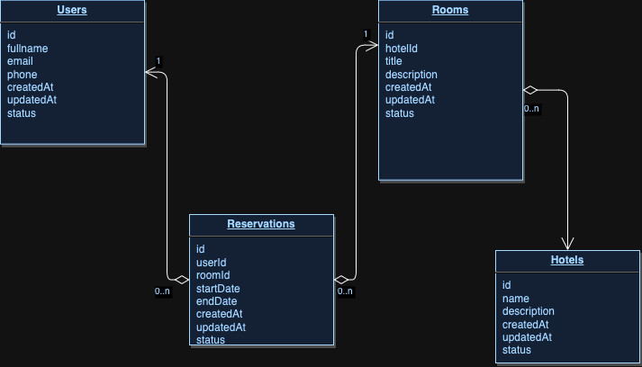

## Description

In order to run the app we need to execute a few commands  

## Installation

```bash
$ npm install
```

### Create `.env` file

Copy content of the `.env.example` to newly created file `.env`, so run

```bash
$ npm run env:config:copy
```

### Docker container and required services 

```bash
$ npm run app:env:init
```


That's it! Now we can run the server and start testing the API!  

```bash
$ npm run start:dev
```

## Postman collection

To speed up the development process you can use prepared collection of end-points in [Develop.postman_collection.json](./schema/Develop.postman_collection.json)

## Swagger documentation page

The swagger documentation page is hosted on the same host as server itself by adding the url `/api`, i.e. if in configuration `APP_PORT` -> `9001` then the swagger page will have an address like [Swagger Page](http://localhost:9001/api#/)

## Database 
The database schema looks like the folowing:



## Migrations

Migrations for the application is placed here -> `./src/database/migrations`

There are a few commands that could help in managing them:
- Run migration -> `npm run migration:run`
- Revert just executed migration `npm run migration:revert`

## Seeders

In order to start using the system, it's required to add some data into the database. 
- Create 5 dummy hotels with rooms -> `npm run seed:create-dummy-hotels`
- Create 5 dummy users -> `npm run seed:create-dummy-users`

## Running the app

```bash
# development
$ npm run start

# watch mode
$ npm run start:dev

# production mode
$ npm run start:prod
```

## License

Nest is [MIT licensed](LICENSE).
